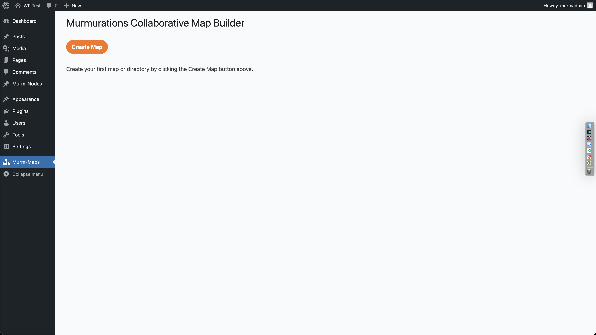
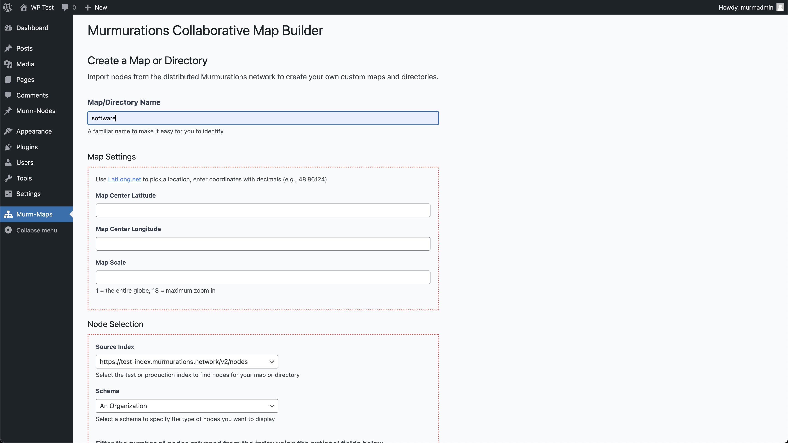
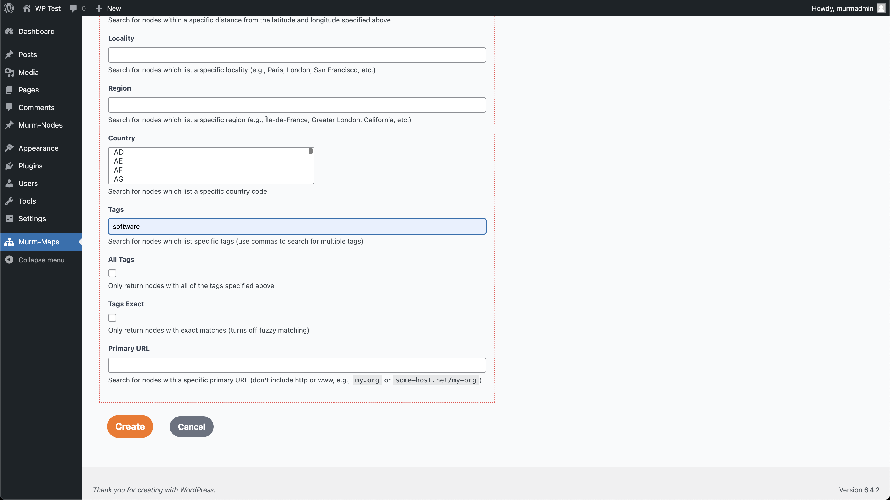
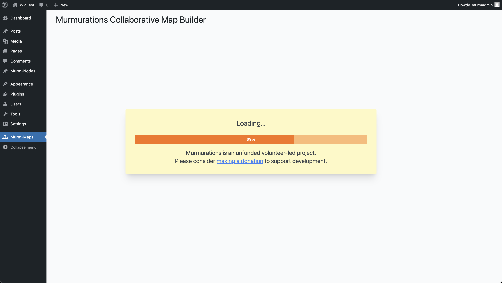
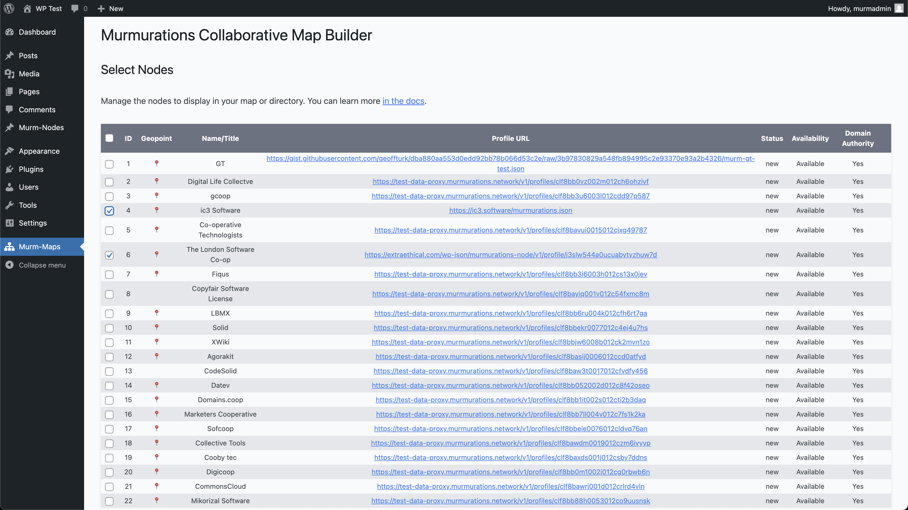
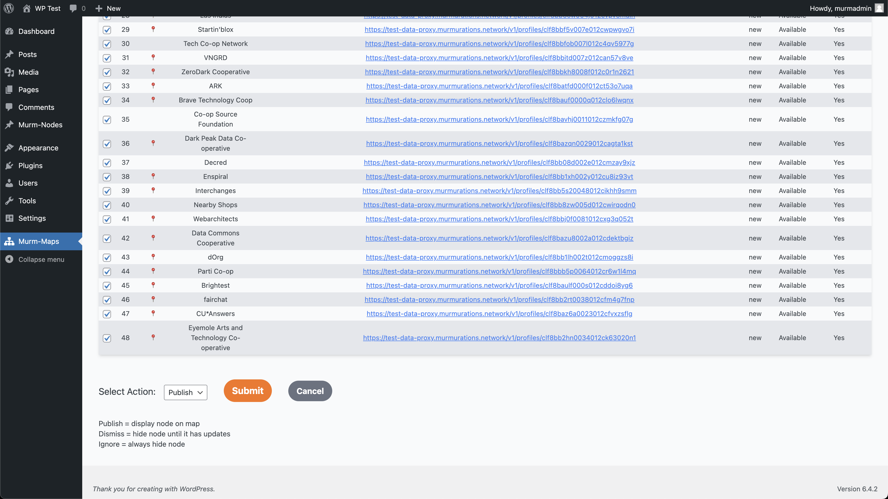
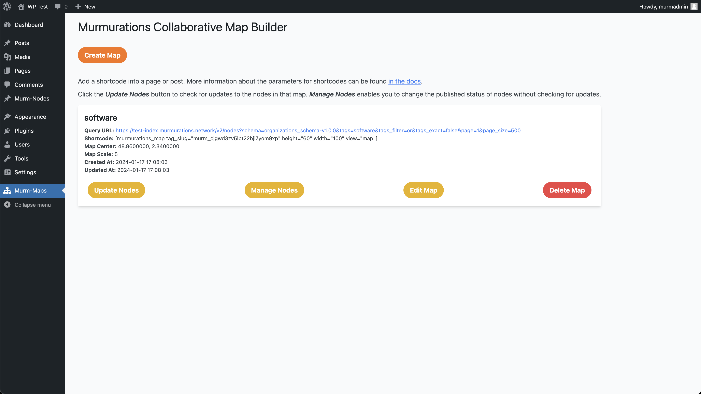
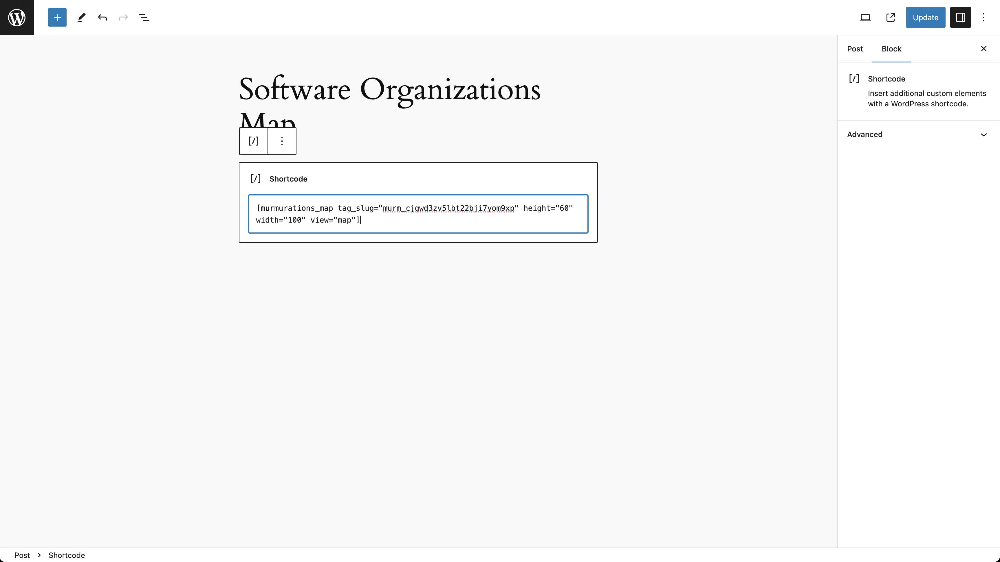
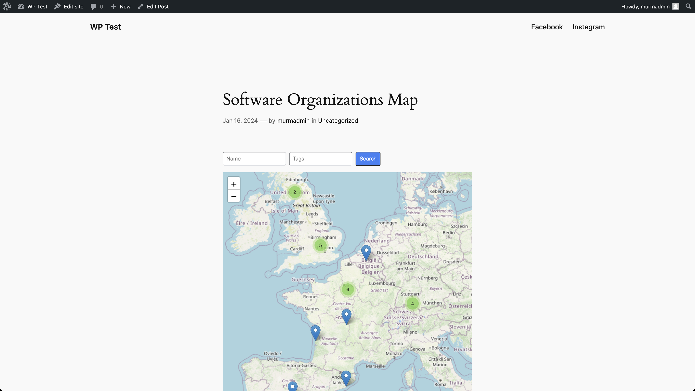

# Murmurations Collaborative Map Builder #
**Contributors:** [geoffturk](https://profiles.wordpress.org/geoffturk/), [vthwang](https://profiles.wordpress.org/vthwang/)  
**Donate link:** https://opencollective.com/murmurations  
**Tags:** murmurations, network, regenerative economy, map  
**Requires at least:** 6.4.2  
**Tested up to:** 6.4.2  
**Stable tag:** 1.0.0  
**Requires PHP:** 8.0  
**License:** GPLv3 or later  
**License URI:** https://www.gnu.org/licenses/gpl-3.0.html  

Create maps and directories of organizations, offers/wants and individuals shared across the Murmurations network

## Description ##

This plugin is designed to collect data from the Murmurations network, store it locally (while allowing manual approval/rejection of collected nodes), and display it in a variety of ways, including via a built in Leaflet map interface, a built-in directory interface, or through WP REST API endpoints that provide data to local client-side interfaces or other services.

Murmurations is a distributed data sharing network built to help connect regenerative economy projects and organizations and make them visible to the world and each other.

The network is comprised of:

- [Nodes](https://docs.murmurations.network/about/common-terms.html#node) and other data hosts that share data in the network
- An [Index](https://docs.murmurations.network/about/common-terms.html#index) that keeps track of what data is available in the network, and where it is located
- [Aggregators](https://docs.murmurations.network/about/common-terms.html#aggregator) that collect data from the network and display it in various ways
- A [Library](https://docs.murmurations.network/about/common-terms.html#library) of schemas that describe the data in the network

To enable these entities to work together, Murmurations provides:

- A protocol for defining and exchanging data about and amongst organizations, based on existing standards such as [JSON Schema](https://json-schema.org/understanding-json-schema/) and [REST APIs](https://www.redhat.com/en/topics/api/what-is-a-rest-api).
- An [Index](https://index.murmurations.network/v2/nodes), a [Library](https://library.murmurations.network/v2/schemas) and a user-friendly data host (our [Profile Generator](https://tools.murmurations.network/profile-generator))) which enables organizations to quickly add themselves to the network.
- [Open source plug-ins and other code](https://github.com/MurmurationsNetwork) to make it as easy as possible to use, share and contribute data to the network in a decentralized way.

The initial use case for Murmurations is to facilitate decentralized mapping of purpose-driven and solidarity economy organizations and projects.

Further historical background is in the 2019 [Murmurations Whitepaper](https://murmurations.network/wp-content/uploads/2019/09/murmurations-white-paper-v0.1.0.pdf).

## Installation ##

This section describes how to install the plugin and get it working.

1. Upload the plugin files to the `/wp-content/plugins` directory, or install the plugin through the WordPress plugins screen directly.
2. Activate the plugin through the 'Plugins' screen in WordPress.
3. Select the Murm-Maps option in the Admin menu and then start building maps with profiles found through the Murmurations Index and sourced from their hosts.

## Frequently Asked Questions ##

### How does it work? ###

The Murmurations Protocol enables individuals and organizations (Nodes) to create Profiles about themselves in order to easily share information with Aggregators, who create Schemas to define the data they need to create maps, directories and content aggregators.

### Can you explain the terms you use? ###

See the [common terms](https://docs.murmurations.network/about/common-terms.html) we use when working with Murmurations and our blog posts [Murmurations explained](https://murmurations.network/2022/07/07/murmurations-explained), and [Using Murmurations](https://murmurations.network/2022/07/12/using-murmurations).

## Screenshots ##

### 1. Initial admin view ###

### 2. Setting up a map ###

### 3. Creating a map ###

### 4. Generating a map ###

### 5. Selecting nodes to display ###

### 6. Submitting nodes ###

### 7. Map created ###

### 8. Adding shortcode to a post ###

### 9. Map displayed in post ###

## Changelog ##

### 1.0.0 ###

* Version 1.0.0 of the Murmuration Collaborative Map Builder plugin is a major update which makes the plugin compatible with the current version of the Index.

## Upgrade Notice ##

This is a major upgrade to work with the updated Index v2.0.0. Please deactivate and delete the old plugin before installing this new release.
